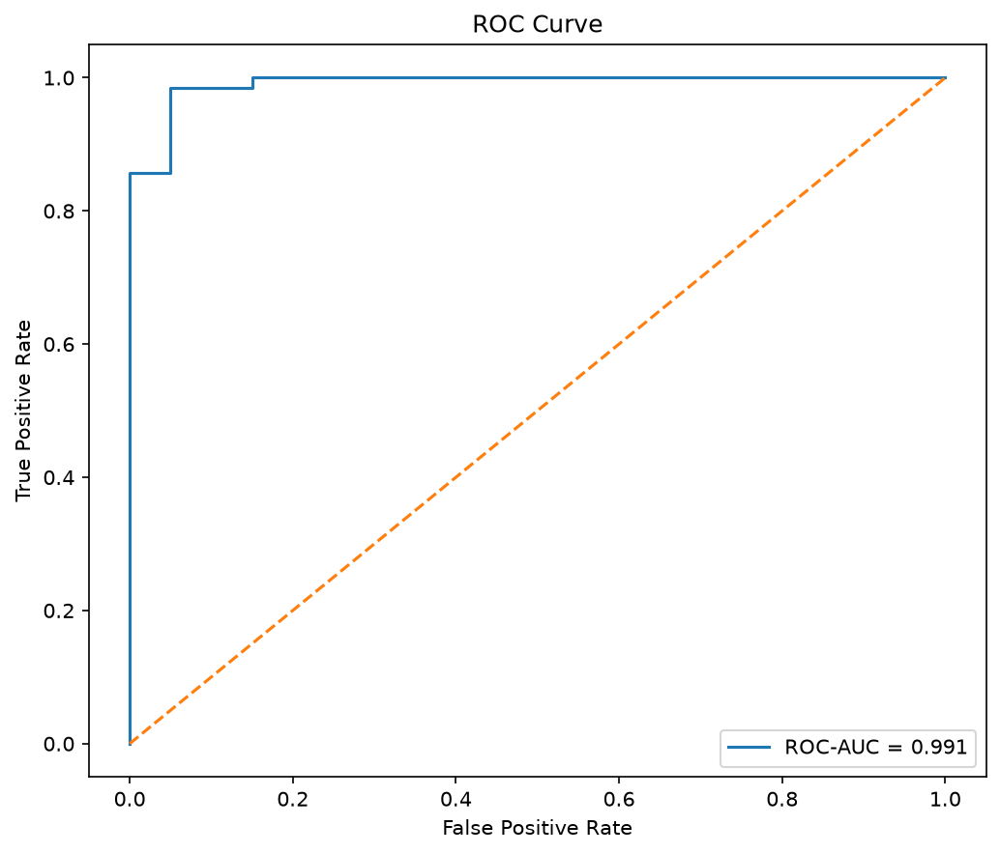
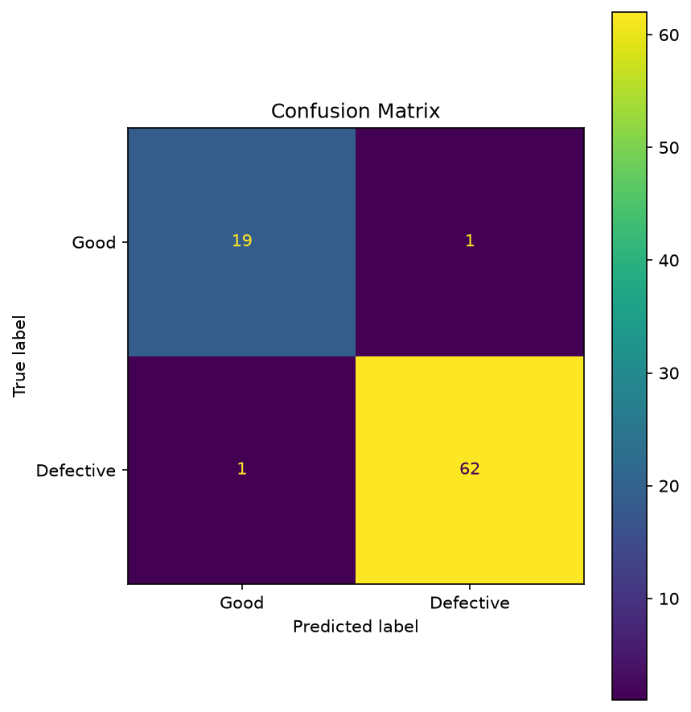
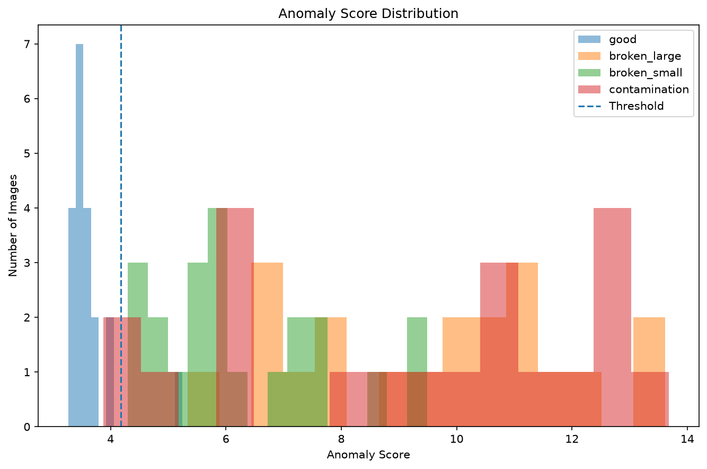

# Visual Defect Detection with PyTorch

A computer vision project for automated visual anomaly detection using PyTorch and the MVTec AD bottle dataset.

The project compares different approaches to visual defect detection, ranging from reconstruction-based anomaly detection with a convolutional autoencoder to feature-space anomaly detection using a pretrained ResNet18.

The final approach uses pretrained ResNet18 features combined with nearest-neighbour distance and achieves an **F1 score of 0.984** and **ROC-AUC of 0.991** on the evaluated MVTec AD bottle test set.

---

## Overview

Automated visual inspection is an important application of computer vision in industrial quality control.

A central challenge is that defective samples are often much less common than normal samples. Instead of relying exclusively on supervised classification, this project investigates anomaly detection approaches that learn the appearance of normal products and identify deviations from them.

The project explores three main approaches:

1. Supervised CNN classification
2. Convolutional autoencoder anomaly detection
3. Pretrained ResNet18 feature-space anomaly detection

The experiments show that pretrained visual features combined with nearest-neighbour anomaly scoring substantially outperform reconstruction-based anomaly detection for this dataset.

---

## Dataset

The project uses the **bottle** category of the MVTec Anomaly Detection dataset (MVTec AD).

The evaluated classes are:

- `good`
- `broken_large`
- `broken_small`
- `contamination`

Normal training images are used to establish the representation of defect-free bottles.

Defective images are used only for evaluation.

The dataset is not included in this repository.

After downloading MVTec AD, place the bottle dataset under:

```text
data/raw/bottle/
├── train/
│   └── good/
│
└── test/
    ├── good/
    ├── broken_large/
    ├── broken_small/
    └── contamination/
```

---

## Methodology

### 1. Convolutional Autoencoder

The first anomaly detection approach uses a convolutional autoencoder trained exclusively on normal bottle images.

The model learns the mapping

```text
Input Image
     ↓
Encoder
     ↓
Latent Representation
     ↓
Decoder
     ↓
Reconstructed Image
```

The underlying assumption is that the autoencoder learns to reconstruct normal bottles better than anomalous bottles.

An anomaly score can therefore be calculated from the reconstruction error.

Two scoring strategies were investigated.

#### Global Reconstruction Error

The first method calculates the mean squared reconstruction error over the complete image:

```text
Original Image
       ↓
Autoencoder
       ↓
Reconstruction
       ↓
Global MSE
       ↓
Anomaly Score
```

A limitation of this approach is that small localized defects contribute only a small fraction of the total image error.

#### Top-1% Reconstruction Error

To increase sensitivity to localized defects, a second anomaly score considers only the 1% of image pixels with the largest reconstruction errors.

This improved the performance compared with global reconstruction error, but the autoencoder still failed to detect a substantial fraction of defective samples.

---

### 2. Pretrained ResNet18 Feature Extraction

The second approach uses transfer learning.

A ResNet18 pretrained on ImageNet is used as a fixed feature extractor. The final classification layer is removed, producing a **512-dimensional feature vector** for each bottle image.

```text
Bottle Image
     ↓
Pretrained ResNet18
     ↓
512-dimensional Feature Vector
     ↓
Feature-Space Anomaly Detection
```

The ResNet18 parameters are not retrained.

Instead, the pretrained network provides a general visual representation that can be used to compare normal and anomalous images.

---

### 3. Center-Distance Anomaly Detection

The first feature-space approach represents normal bottle images by their mean feature vector.

For a feature vector \(f(x)\), the anomaly score is its Euclidean distance from the normal feature center:

\[
d(x) = \|f(x) - \mu_{\text{normal}}\|_2
\]

where

\[
\mu_{\text{normal}}
=
\frac{1}{N}
\sum_{i=1}^{N}
f(x_i)
\]

A larger distance indicates that the image differs more strongly from the average normal bottle representation.

---

### 4. Nearest-Neighbour Anomaly Detection

The final method avoids representing all normal samples using a single center.

Instead, each test image is compared with all normal training samples in feature space.

The anomaly score is the distance to the nearest normal training sample:

\[
d(x)
=
\min_i
\|f(x)-f(x_i^{\text{train}})\|_2
\]

This allows the normal data to contain multiple valid visual appearances rather than forcing them into a single average representation.

The anomaly threshold is calculated from the normal validation data using the **95th percentile** of the validation anomaly scores.

---

## Experimental Results

### Autoencoder

The reconstruction-based approach showed that localized reconstruction errors were more informative than global reconstruction error.

| Method | Accuracy | Precision | Recall | F1 |
|---|---:|---:|---:|---:|
| Global Reconstruction MSE | 0.566 | 0.886 | 0.492 | 0.633 |
| Top-1% Reconstruction Error | 0.614 | 0.943 | 0.524 | 0.673 |

Although precision was high, recall remained limited.

This indicates that the convolutional autoencoder reconstructed many anomalous bottle images sufficiently well that their reconstruction error remained below the anomaly threshold.

---

### ResNet18 Feature-Space Detection

Using pretrained ResNet18 features resulted in substantially better separation between normal and anomalous images.

| Method | Accuracy | Precision | Recall | F1 | ROC-AUC |
|---|---:|---:|---:|---:|---:|
| Center Distance | 0.819 | 0.980 | 0.778 | 0.867 | 0.975 |
| **Nearest Neighbour** | **0.976** | **0.984** | **0.984** | **0.984** | **0.991** |

Nearest-neighbour feature distance produced the best overall performance.

Compared with the center-distance approach, recall increased from **77.8% to 98.4%**, while maintaining very high precision.

---

## Final Model

The final anomaly detection pipeline is:

```text
Input Bottle Image
        ↓
ImageNet Preprocessing
        ↓
Pretrained ResNet18
        ↓
512-D Feature Vector
        ↓
Nearest Normal Training Feature
        ↓
Euclidean Distance
        ↓
Anomaly Score
        ↓
95th-Percentile Threshold
        ↓
GOOD / DEFECTIVE
```

Final test performance:

| Metric | Result |
|---|---:|
| Accuracy | **97.6%** |
| Precision | **98.4%** |
| Recall | **98.4%** |
| F1 Score | **98.4%** |
| ROC-AUC | **99.1%** |

These results demonstrate that feature-space anomaly detection with pretrained CNN representations can provide substantially better defect discrimination than pixel-level reconstruction error for this dataset.

---

## Visualizations

The evaluation pipeline generates several visualizations.

### ROC Curve

The ROC curve illustrates the ability of the continuous anomaly score to distinguish normal and defective samples.

```text
results/resnet/roc_curve.png
```



### Confusion Matrix

```text
results/resnet/confusion_matrix.png
```



### Feature-Distance Distribution

The anomaly-score distributions show the separation between normal samples and the individual defect categories.

```text
results/resnet/feature_distance_distribution.png
```



---

## Project Structure

```text
visual-defect-detection/
│
├── data/
│   └── raw/
│       └── bottle/
│
├── models/
│
├── results/
│   ├── autoencoder/
│   └── resnet/
│
├── src/
│   └── defect_detection/
│       ├── __init__.py
│       ├── anomaly_dataset.py
│       ├── autoencoder.py
│       ├── anomaly_training.py
│       ├── anomaly_evaluation.py
│       ├── feature_anomaly.py
│       ├── resnet_features.py
│       └── plotting.py
│
├── tests/
│   ├── test_anomaly.py
│   └── test_models.py
│
├── train_autoencoder.py
├── evaluate_autoencoder.py
├── evaluate_resnet.py
├── prepare_resnet_model.py
├── predict.py
├── pyproject.toml
├── README.md
└── .gitignore
```

---

## Installation

Clone the repository and navigate to the project directory.

Install the project in editable mode:

```bash
python -m pip install -e .
```

For development and testing:

```bash
python -m pip install -e ".[dev]"
```

The main dependencies are:

- PyTorch
- TorchVision
- NumPy
- Matplotlib
- scikit-learn
- Pillow
- pytest

---

## Usage

### Evaluate the Autoencoder

Train the convolutional autoencoder:

```bash
python train_autoencoder.py
```

Evaluate the reconstruction-based anomaly detection methods:

```bash
python evaluate_autoencoder.py
```

---

### Evaluate ResNet18 Feature Detection

The pretrained ResNet18 approach does not require additional CNN training.

Run:

```bash
python evaluate_resnet.py
```

This compares:

- Center distance
- Nearest-neighbour distance

and generates the final evaluation plots.

---

### Prepare the Final Anomaly Detector

Generate and store the normal training features and anomaly threshold:

```bash
python prepare_resnet_model.py
```

This creates the reference data required for single-image inference.

---

### Predict a Single Image

Run:

```bash
python predict.py path/to/image.png
```

Example:

```bash
python predict.py data/raw/bottle/test/broken_large/bottle_broken_large_000.png
```

Example output:

```text
Prediction    : DEFECTIVE
Anomaly score : 12.8463
Threshold     : 8.7214
```

The anomaly score represents the feature-space distance between the input image and its nearest normal training sample.

---

## Testing

Run the test suite with:

```bash
pytest
```

The tests cover core functionality including:

- Autoencoder output dimensions
- ResNet18 feature dimensions
- Feature-distance calculation
- Nearest-neighbour distance
- Threshold calculation
- Anomaly classification

---

## Key Findings

The experiments produced three main observations:

1. **Global reconstruction error is poorly suited to localized visual defects.**  
   Small anomalous regions contribute relatively little to the reconstruction error of the complete image.

2. **Pretrained CNN features provide a substantially stronger representation.**  
   ResNet18 features separate normal and defective bottle images much better than pixel-level reconstruction errors.

3. **The representation of normal variability matters.**  
   Nearest-neighbour distance substantially outperformed distance to a single normal feature center, suggesting that normal bottle images occupy multiple regions in feature space.

---

## Limitations

The reported results should be interpreted as experimental results on the evaluated MVTec AD bottle dataset rather than as evidence of production-ready industrial performance.

Important limitations include:

- The evaluation set is relatively small.
- Only the bottle category of MVTec AD was investigated.
- The pretrained ResNet18 was trained on ImageNet rather than industrial inspection data.
- Euclidean feature distance is a relatively simple anomaly-scoring method.
- Model selection between different anomaly-scoring approaches was informed by their performance on the available test data.

A production system would require independent validation data, evaluation on substantially larger datasets, robustness testing under changing acquisition conditions, and application-specific threshold selection.

---

## Future Improvements

Possible extensions include:

- Patch-level ResNet feature extraction for anomaly localization
- Visualization of anomalous image regions
- k-nearest-neighbour anomaly scoring
- Mahalanobis-distance-based anomaly detection
- Comparison with dedicated anomaly-detection methods such as PatchCore
- Evaluation across additional MVTec AD categories
- GPU-accelerated nearest-neighbour search for larger reference datasets

---

## Technologies

- Python
- PyTorch
- TorchVision
- ResNet18
- NumPy
- scikit-learn
- Matplotlib
- Pillow
- pytest

---

## Summary

This project demonstrates an end-to-end computer vision workflow for visual anomaly detection, including dataset preparation, neural-network-based feature extraction, reconstruction-based anomaly detection, transfer learning, nearest-neighbour methods, quantitative evaluation, visualization, testing, and command-line inference.

The final pretrained ResNet18 nearest-neighbour approach achieved:

**F1 = 0.984 | ROC-AUC = 0.991**

on the evaluated MVTec AD bottle test set.